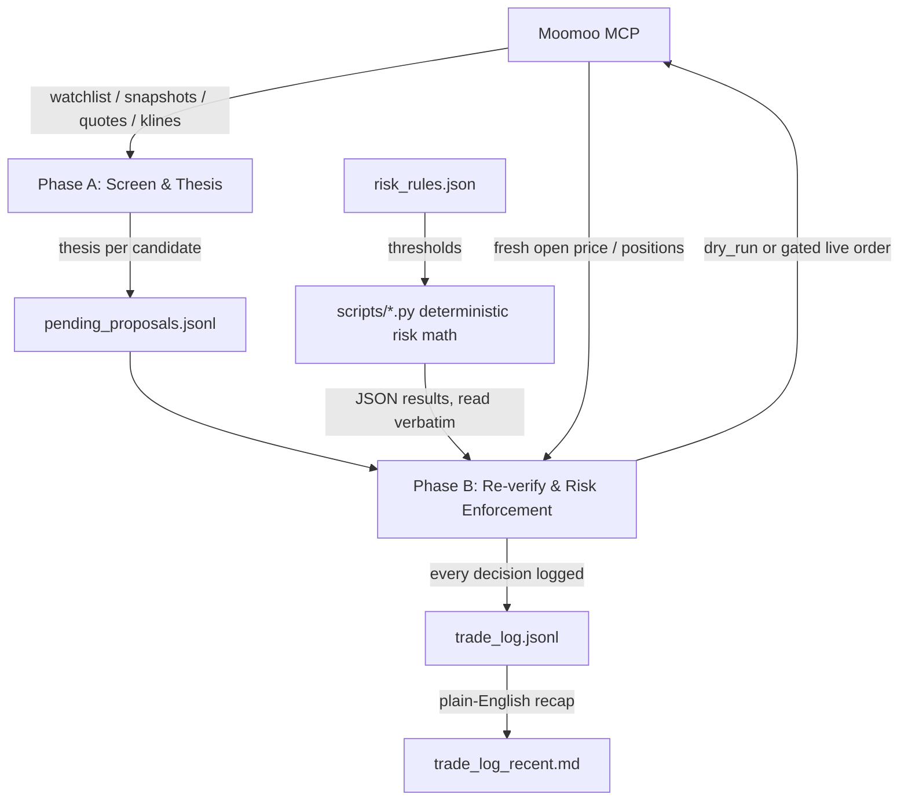

# FriesTrader


An AI trading agent built to run cheap and fully on its own, trading real
orders on [Moomoo](https://www.moomoo.com) using the
[moomoo-api-mcp](https://github.com/Litash/moomoo-api-mcp) MCP server and
Moomoo's [OpenAPI](https://www.moomoo.com/OpenAPI).
Once set up, it's able to run unattended on its own schedule every
weekday, no manual triggering needed, and the actual safety mechanism is
mechanical, auditable risk rules, not the model's judgment. Two short
scheduled Claude Code sessions a day screen stocks, write out their
reasoning, and (only under a narrow, explicit gate) place real trades,
without a team of specialized sub-agents burning tokens on every
decision. Because it's just two lean sessions instead of a multi-agent
pipeline, it runs comfortably on a Claude Pro subscription (as low as
$200/year on the annual plan), no Claude Max or metered API spend required.

Forked from [YizhiSong/FriesTrader](https://github.com/YizhiSong/FriesTrader)
and adapted for Moomoo instead of Robinhood. The architecture and risk logic
are identical — only the broker integration changes.

> If you build on this, a star, a fork, or a link back to this repo is
> always appreciated.

## Why this is safer than it sounds

"Fully autonomous" and "trading real money" together should make you
nervous. Here's what actually stands between a thesis and an order:

- **Every trade passes through mechanical rules the LLM cannot
  override** — position sizing, stop-loss, take-profit, loss limits, a
  wash-sale guard, each computed by a small stdlib-only Python script in
  `scripts/` rather than the model doing arithmetic in prose. Same
  inputs always produce the same numbers, and a good story never cancels
  a stop-loss.
- **New deployments start in `dry_run` and stay there** for a minimum
  number of cycles (`dry_run_min_cycles_before_live`) before a live
  order is even possible, so you can watch it screen and reason before
  it touches real money.
- **Paper trading before live:** `trd_env: "SIMULATE"` in `risk_rules.json`
  uses Moomoo's built-in paper trading accounts. Start there.
- **Only you can flip `execution.mode` to `"live"`** — the agent is
  explicitly barred from ever changing this itself, and refuses to
  place live orders while `dry_run`.
- **Every decision is logged, approved or rejected** — `trade_log.jsonl`
  is append-only, so you can check whether the reasoning is actually
  sound, not just trust it.

## Requirements

- A [Moomoo](https://www.moomoo.com) account with
  [OpenAPI](https://www.moomoo.com/OpenAPI) access enabled.
- **OpenD** — Moomoo's local gateway daemon, running on a machine that's
  available during market hours. See `MOOMOO_SETUP.md` for installation.
- **moomoo-api-mcp** — the MCP server bridging Claude Code to OpenD.
  Install: `uvx moomoo-api-mcp` (or `uv tool install moomoo-api-mcp`).
- [Claude Code](https://claude.com/claude-code), on a Pro subscription or
  higher.
- A GitHub account, to host your own copy of this repo — needed for
  cloud-hosted deployment (see "How it works" below).

## How it works

Trading runs as **two separate phases, on two separate schedules** — a
full trading day's closing data feeds the thesis, and a fresh opening
price is used for the actual order, rather than trading on a stale
overnight price.



Only one step is a judgment call — the Phase A thesis. Every filter,
ranking, and size is a deterministic script.

**Phase A — screen and write a thesis** (Steps 1–3, ~4:30pm Central
weekdays; spec `PHASE_A_TASK.md`). Places no orders.

1. **Universe.** Start with your Moomoo watchlist (up to
   `universe.watchlist_max_candidates`, fetched via `get_user_security`),
   plus up to `universe.supplementary_scan_max_candidates` movers from a
   web search for notable market activity, plus every position you currently
   hold. Remove anything failing the `universe` filters in `risk_rules.json`
   — volume, market-cap band, minimum price, leveraged/inverse ETFs, price
   below its 200-day moving average. Held positions are always kept.
2. **Signal gate.** A candidate is researched only if it meets **any one**
   of `signal_thresholds`: a 60-day price move, a volume spike (computed
   from the last 30 daily bars via `get_historical_klines`), or a price near
   its 52-week high or low (from `get_market_snapshot`). The rest are logged
   `no_signal` with no thesis. Held positions are always researched.
3. **Thesis.** The model runs a news search and writes a line to
   `pending_proposals.jsonl`: `direction` (`long` / `avoid` /
   `exit_existing`), `conviction` (`high` / `medium` / `low`, against a
   fixed rubric so the same facts give the same rating), `risk_flags`, and
   percent below the 52-week high. This is the stock selection.

**Phase B — re-verify, enforce the rules, place orders** (Steps 4–9,
~8:35am Central weekdays; spec `PHASE_B_TASK.md`). Decides which `long`
candidates are bought:

- **Re-verify.** Re-check each proposal against the opening price. Run all
  sells (stop-loss, take-profit, `exit_existing`) before any buy.
- **Buy gate** (`entry_gate.py`). The buy is skipped this cycle if the
  price is more than `entry_price_gap.max_pct` above the thesis price,
  more than `entry_extension.max_extension_pct` above its 20-day average,
  or under a wash-sale or sell-re-entry lock.
- **Rank** (`rank_candidates.py`). By conviction, then fewer `risk_flags`,
  then larger percent below the 52-week high.
- **Size** (`position_sizing.py`). In ranked order, each candidate is
  bought at its conviction-tier size (a fixed percent of the account)
  until `max_concurrent_positions` or the `min_cash_buffer_pct` floor is
  reached.
- **Orders.** Pre-flight via `get_max_tradable`, then `place_order` with
  `trd_side="BUY"` or `trd_side="SELL"`, fill confirmed via `get_orders` +
  `get_deals`. All in the environment set by `risk_rules.json`'s `trd_env`.

Every decision is logged to `trade_log.jsonl`. Some cycles buy nothing.

**Moomoo-specific notes:**
- Stock codes are always `"<MARKET>.<SYMBOL>"` (e.g. `"US.AAPL"`, `"US.MSFT"`).
- `trd_env: "SIMULATE"` uses Moomoo's paper trading — full API support, no
  real money. `trd_env: "REAL"` requires `unlock_trade` at session start.
- Phase B accounts for `unlock_trade` in Step 0 for REAL accounts.
- Historical data via `get_historical_klines` with `ktype="K_DAY"` and
  `autype="QFQ"` (forward split-adjusted). Average volume is computed from
  the last 30 daily bars' volume field rather than a fundamentals API call.
- Realized P&L for loss limits is computed from `trade_log.jsonl` sell
  entries (fill_price vs. logged entry_price) rather than a broker P&L API.

**Example.** `US.AAPL` is in your Moomoo watchlist at $200, a $3T-cap trading
above its 200-day average, so it passes the universe filters. Its 52-week high
is $260, and at $200 it's 23% below that high — not within the 3% extreme
threshold. But it's up 14% over 60 days, so it meets the price-move threshold
and gets a news search; the model finds a confirmed earnings beat, no risk
flags, and rates it `high` conviction, `long`. Next morning it opens at $202,
within all buy-gate limits, and is the only `high`-conviction candidate, so it
ranks first. `high` is 20% of the account: on $500 that is a $100 buy, placed
if the cash buffer holds. Had it opened at $209 — 4.5% above the thesis price,
over the `entry_price_gap.max_pct` limit — the buy would be skipped that cycle.

See `MOOMOO_SETUP.md` for full setup instructions including OpenD installation.

**The key files:**
- `risk_rules.json` — hard, mechanical limits plus account settings. Fields:
  `acc_id` (Moomoo account ID), `trd_env` (SIMULATE/REAL), `moomoo_market`
  (default "US"), plus all position sizing, stop-loss, loss limit, and
  universe filter parameters. None of these should be changeable by the agent
  during a trading run.
- `scripts/` — the deterministic risk-math engines Phase B runs:
  - `entry_gate.py` — the buy gate (price gap, extension, wash-sale, re-entry lock).
  - `pnl_pct.py` — daily/weekly loss-limit % against `starting_capital_usd`.
  - `stop_loss.py` — fixed or volatility-scaled stop_pct (clamped stdev of
    daily returns), trailing-high reference once a take-profit tier fires.
  - `take_profit.py` — tiered partial-exit firing with cascading quantity logic.
  - `conviction_trim.py` — trims overweight low-conviction positions.
  - `rank_candidates.py` — conviction, `risk_flags`, `pct_below_52wk_high` ranking.
  - `position_sizing.py` — sizing, concurrency, and cash-buffer checks.
  Each takes plain CLI args, prints one JSON object, stdlib-only (no deps).
- `PHASE_A_TASK.md` / `PHASE_B_TASK.md` — full, self-contained specs.
- `MOOMOO_SETUP.md` — OpenD installation and Moomoo account configuration.
- `trade_log_template.jsonl` — example log line shapes.

## See it in action

This is what a real Phase B cycle actually produces (`trade_log_recent.md`,
regenerated every run, symbols genericized):

> **2026-07-09**
>
> **Loss limit**: OK — daily 0.0%, weekly -2.1%, within -5%/-10% limits.
>
> **Held positions** (stop-loss / take-profit):
> - US.EXAMPLE — stop 7.00% (vol-scaled), drawdown -2.3% — holding
>
> **New-entry candidates considered**: US.OTHER, US.ANOTHER
> - US.OTHER — approved: medium conviction, $60.00 (12% of account)
> - US.ANOTHER — rejected: max_concurrent_positions already filled this cycle
>
> **Orders placed**: US.OTHER — buy $60.00 (dry_run)

## What this does and doesn't solve

- It gives you a structured, auditable version of "let an LLM screen and
  reason about trades" instead of an opaque one.
- It does **not** make LLM-driven stock picking more likely to beat a
  simple index fund — there's no established track record for that.
- The risk rules are the actual safety mechanism here, not the reasoning
  quality. Treat loosening them as the highest-risk change you can make.
- This is a personal project shared for others to learn from or adapt.
  It is genuinely not financial advice, and running it against real money is
  entirely your own decision and risk.

## First-time setup

**Get your own copy first:** Click **"Use this template"** (top of GitHub
page) and make the result **private** — it'll accumulate real trading data
once running.

1. Follow `MOOMOO_SETUP.md` — install OpenD, get your `acc_id`, configure
   `moomoo-api-mcp` in Claude Code, create a Moomoo watchlist.
2. Fill in `risk_rules.json`: `acc_id`, `starting_capital_usd`,
   `universe.watchlist_name`, `wash_sale_avoidance.linked_accounts`. Review
   every other threshold — the defaults are illustrative.
3. Keep `trd_env: "SIMULATE"` and `execution.mode: "dry_run"` initially.
4. After each cycle, read `trade_log.jsonl` yourself — look at rejected
   candidates and stop-loss triggers, not just what "worked."
5. Only flip `execution.mode` to `"live"` yourself, by hand, after at least
   `dry_run_min_cycles_before_live` dry-run cycles. Only flip `trd_env` to
   `"REAL"` after you're confident in both the pipeline and your OpenD setup.

## Running it

Two schedules need to fire: Phase A around 4:30pm Central on weekdays
(hand Claude Code `PHASE_A_TASK.md` to execute), and Phase B around 8:35am
Central on weekdays, 5 minutes after market open (hand it `PHASE_B_TASK.md`).

**Before each session:** ensure OpenD is running and connected to Moomoo.

- **Recommended: Claude Code's own scheduled cloud routines.** Set one
  routine to run `PHASE_A_TASK.md` on the Phase A schedule and a second for
  `PHASE_B_TASK.md` on the Phase B schedule, with the MCP connections
  including `moomoo-api-mcp`. Note: the Claude Code session runs in the cloud,
  but it connects to your locally-running OpenD — you need OpenD accessible
  from wherever Claude Code runs (local machine, cloud VM, or via a tunnel).
- **Alternative: a local scheduler** (cron, launchd, Task Scheduler) invoking
  the Claude Code CLI, with OpenD running on the same machine.

### Routine prompt templates

Copy one in and swap in your own acc_id.

#### Phase A prompt

```
You are running the DAILY automated Phase A step (screening & thesis only) for a small real personal trading account on Moomoo (acc_id: <your acc_id from risk_rules.json>). This repo has already been cloned into your working directory. PHASE_A_TASK.md in this checkout is the full source-of-truth spec for what to do (Steps 1-3) — read and follow it exactly.

First, determine today's REAL date, day-of-week, and time-of-day in America/Chicago (Central) via Bash — do not guess or infer these:
TZ='America/Chicago' date +'%Y-%m-%d'
TZ='America/Chicago' date +'%A'
TZ='America/Chicago' date +'%H:%M:%S'
Use the date as the 'date' field and the time as the 'timestamp' field (time-of-day only, e.g. "16:30:01") on every line you write, per PHASE_A_TASK.md's Output section.

Read risk_rules.json fresh from this checkout every run — never assume prior values or cache across runs.

Follow PHASE_A_TASK.md's Steps 1-3 exactly. Overwrite pending_proposals.jsonl in this checkout with this run's results. Do NOT touch trade_log.jsonl.

Hard stop: place_order, cancel_order, and modify_order should not be available to you in this session — do not attempt them regardless.

When pending_proposals.jsonl is fully written, commit and push it back to this repo's main branch:
git add pending_proposals.jsonl
git commit -m "Phase A run <date> <timestamp>"
git push origin main
If the push is rejected, run 'git pull --rebase origin main' once and retry once. If it still fails, report the exact conflict/error.

End with a concise summary of what you screened/filtered/proposed, and confirm the push succeeded (include the resulting commit hash).
```

#### Phase B prompt

```
You are running the DAILY automated Phase B step (re-verify, risk enforcement, order review/execution, logging) for a small real personal trading account on Moomoo (acc_id: <your acc_id from risk_rules.json>). This repo has already been cloned into your working directory. PHASE_B_TASK.md in this checkout is the full source-of-truth spec for what to do (Steps 4-9) — read and follow it exactly.

First, determine today's REAL date, day-of-week, and time-of-day in America/Chicago (Central) via Bash:
TZ='America/Chicago' date +'%Y-%m-%d'
TZ='America/Chicago' date +'%A'
TZ='America/Chicago' date +'%H:%M:%S'
Use the date as the 'date' field and the time as the 'timestamp' field on every line you write to trade_log.jsonl. Determine is_monday from the day-of-week output for the Step 7 weekend-gap check.

Read risk_rules.json fresh from this checkout every run — never assume prior values or cache across runs. Read pending_proposals.jsonl and trade_log.jsonl fresh too.

Follow PHASE_B_TASK.md's Steps 4-9 exactly, including the idempotency rule (key off each candidate's own proposal_date), the dry-run cycle count rule, the priority/tiebreak rules, and the live-order gate. Step 0 of PHASE_B_TASK.md handles unlock_trade for REAL accounts — follow it. This task is authorized to place real live orders only under that gate's narrow, explicit condition. Do not add, remove, or loosen any gate condition on your own judgment, and never change execution.mode, trd_env, or any other value in risk_rules.json yourself.

Append every decision to trade_log.jsonl (do not touch pending_proposals.jsonl except to read it). When done, commit and push trade_log.jsonl back to this repo's main branch:
git add trade_log.jsonl trade_log_recent.md
git commit -m "Phase B run <date> <timestamp>"
git push origin main
If the push is rejected, run 'git pull --rebase origin main' once and retry once. If it still fails, report the exact conflict/error — trade_log.jsonl is an append-only audit trail; any conflict here is serious.

End with a concise summary of what you checked, approved, rejected, and (if applicable) placed, and confirm the push succeeded (include the resulting commit hash).
```

### Example output

**Phase A — thesis record** (one JSON line per candidate in `pending_proposals.jsonl`):

```json
{
  "date": "YYYY-MM-DD",
  "timestamp": "HH:mm:ss",
  "symbol": "US.XXXX",
  "stage": "thesis",
  "thesis": "1-3 sentences on what changed and why it might matter",
  "conviction": "low | medium | high",
  "invalidation": "what would prove this thesis wrong",
  "direction": "long | avoid | exit_existing",
  "risk_flags": [],
  "pct_below_52wk_high": 0.15,
  "sources": ["Reuters: https://...", "Company Q2 press release: https://..."]
}
```

**Phase B — `trade_log.jsonl`** (append-only, one line per decision):

```json
{"date": "2026-07-10", "timestamp": "08:38:10", "symbol": "US.EXAMPLE", "stage": "risk_check", "passed": true, "conviction": "medium", "risk_flags": [], "pct_below_52wk_high": 0.08, "proposal_date": "2026-07-09", "position_size_usd": 60.00, "concurrent_positions_after": 2, "cash_remaining_after": 340.00, "cash_buffer_after_pct": 0.34}
{"date": "2026-07-09", "timestamp": "08:35:12", "symbol": "US.EXAMPLE", "stage": "order", "mode": "dry_run", "action": "buy", "dollar_amount": 60.00, "quote_ask": 84.20, "quantity": 0.712, "would_execute": true, "review_alerts": "none", "proposal_date": "2026-07-09"}
{"date": "2026-07-09", "timestamp": "08:35:14", "symbol": "US.EXAMPLE", "stage": "order", "mode": "live", "action": "buy", "dollar_amount": 50.00, "quote_ask": 84.20, "quantity": 0, "placed": true, "order_id": "6a636ac9-9fa0-4f13-94b4-65dcee942b51", "order_state": "FILLED_ALL", "fill_price": 84.05, "fill_quantity": 1, "proposal_date": "2026-07-09"}
{"date": "2026-07-10", "timestamp": "08:38:30", "symbol": "US.OTHER", "stage": "stop_loss", "entry_price": 100.00, "current_price": 92.50, "stop_reference_basis": "average_cost", "stop_reference_price": 100.00, "stop_pct_used": 0.075, "stdev_20d": 0.030, "drawdown_pct": 0.075, "triggered": true, "action": "sell_full_position"}
```

Note: Moomoo uses integer `qty` (whole shares only for US stocks in most cases).
The `quantity` field in order logs reflects whole shares, not fractional.

## Keeping your copy updated

Pull upstream improvements:
```
git remote add upstream https://github.com/YizhiSong/FriesTrader.git
git fetch upstream
git merge upstream/main
```
Resolve conflicts in `risk_rules.json` by hand — your own account details
and thresholds should win, not upstream's placeholders.

## License

MIT — see `LICENSE`. Provided as-is, with no warranty; see the license for
the full disclaimer. Original work by Yizhi Song; Moomoo adaptation by
Roy Li.
